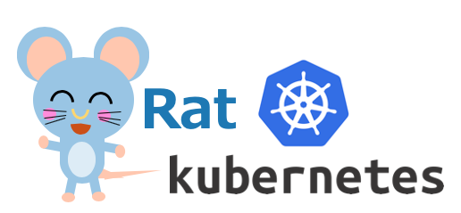

# Rat K8s

**Rat Kubernetesのロゴ**

Rat-K8sは、学習と設計のための実験環境を目的とした、マルチマスターのアップストリームのKubernetes環境です。
これには以下の特徴がある。

* kubeadm コマンドを使用せず、アップストリームKubernetesのバイナリをダウンロードして、Kubernetesクラスタを構築する方法を採用している。今後、ソースコードからビルドする方法に対応する。
* クラスタネットワークは、CNIプラグインを使用しないブリッジネットワークかFlannelを選択できる。ブリッジを選ぶ事で、ノードのネットワーク環境をオーバーレイする事なく利用するので、高パフォーマンスが期待できる。今後、Calicoなど他のCNIプラグインに対応を進めていく。
* kube-apimasterなどのK8sの基本的なコンポーネントは、ダウンロードまたはビルドしたバイナリをsystemdからの起動で実行する。
* マスターノードは、１台と３台構成を選択できる。それぞれのマスターノード上にetcdを動作させ高可用性を確保する。マスターノードを３台で構成する場合は、HA構成の内部ロードバランサーを使用して、可用性と負荷分散を実施する。
* 外部むけロードバランサーを立て、クラウス外からのトラフィックをポッドへ導く。
* K8sクラスタの構築は、vagrantをフロントエンドとして、virtualboxの仮想サーバーを起動する。そして、bootnodeを介してansibleを各ノードで実行する。
* K8sクラスタの構成は、テンプレートとなるYAMLファイルから選択して、編集する事で、構成を変更する事ができる。

## 起動方法

起動は２段階で、最初に仮想サーバーを起動する。
次のコマンドで、クラスタ構成ファイルを読み込んで、Ansibleのコードを生成する。

~~~
git clone https://github.com/takara9/rat-k8s rat1
cd rat1
./setup.rb -f cluster-config/full.yaml -s auto
~~~
次にbootnodeからansibleを実行する事で、Kubernetesクラスタの設定が完了する。

~~~
vagrant ssh bootnode
cd /vagrant
ansible-playbook -i hosts_k8s playbook/install_k8s.yml
~~~
このプレイブックが完了すると、引き続き bootnodeで kubectlを実行できる。

~~~
kubectl get node
~~~

## クリーンナップ方法
クラスタを起動したディレクトリで、以下のコマンドを実行する事で、仮想マシンごと削除できる。

~~~
cd rat1
vagrant destroy -f
~~~

## 前提条件

仮想サーバーのホストはVagrant+VirtualBoxが動作すればLinux, MacOS, WindowsなどのホストOSを問いません。

* Vagrant (https://www.vagrantup.com/)
* VirtualBox (https://www.virtualbox.org/)
* メモリ16GB以上

## TODOなど、やってみたいこと。

技術的な理解を深め、スキルを磨くことを目指して、実施したいこと

* 既知の問題の解決
* 内部用ロードバランサーをKeepalivedでHA化
* 外部むけロードバランサー(HA-PROXY)と外部DNSの連携
* Flannel と Bridge の選択的利用
* crictl の環境設定
* etcdctl の動作確認
* BridgeでのCalicoの適用
* コンフィグスクリプトの開発、ノード数、資源量変更など
* Terraformで作成したホストでのk8sのデプロイ

