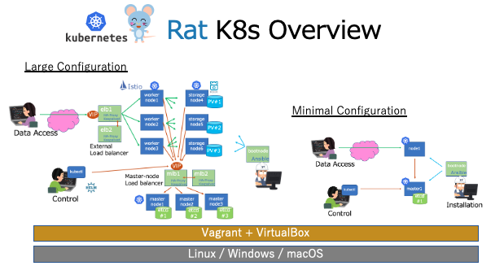

# Rat K8s

**Rat Kubernetesのロゴ**

RatK8sは、実験動物のラットにかけて、Kubernetesの学習と実験用を目的としたアップストリームKubernetesのクラスタ構成である。Kubernetesの本番システムの設計のための検証作業などを、手軽に個人のパソコン環境で実施できる様に、Vagrant + VirtalBox で仮想マシン上で稼働する。
そのため、仮想マシンのホストOSは macOS、Linux, Windowsのいづれでも良い。また、今後、Terraform + パブリッククラウドでも稼働するように発展させたい。

RatK8sには以下の特徴がある。

* K8sクラスタの仮想マシンの構築は、マスター/ワーカーそしてロードバランサーなどを起動する。
* kubeadm などツールを使用せず、playbook を読めば、すべての作業が手作業で再現できることを目指す。
* ローカルでソースコードからビルドしたKubernetesをデプロイできることを目指す。
* クラスタ・ネットワークは、CNIプラグインとして bridge, flannel, calico を使用できることを目指す。
* kube-apiserver,kube-controller-manager,kube-scheduler,kube-proxy,kubeletなどはsystemd から起動する。基本的なコンポーネントにコンテナを使用しない。
* マスターノードの数は１〜３を選択できる。そしてetcdはマスターノードで動作する。マスターノードが複数の場合はetcdは、それぞれをpeerとして高可用性を実現する。
* マスターノードを複数で稼働させる場合は、HA構成のHA-Proxyをmlb1とmlb2として、keeepalivedを併用してVIPを設定する。
* K8sクラスタ外から内部へのリクエスト転送は、HA-ProxyとKeepalivedで構成した elb1/elb2 のVIPで受けて内部へ転送する。
* K8sクラスタの構成は、構成パターンファイルから選択して、setup.rbによってplaybookを生成する。

## 構成パターン

学習や設計のための検証実験など、目的に応じて構成を変更できるようにした。 Ansibleのプレイブックの生成プログラム setup.rbがcluster-configの定義ファイルをプレイブックの生成プログラム setup.rbが読んで必要なプレイブックの要素を生成する事で実現する。

* [最小構成](docs/config-02.md) マスターノード x1, ワーカーノード x1、ブートノード x1
* [デフォルト構成](docs/config-03.md) マスターノード x1, ワーカーノード x1、ブートノード x1
* [フル構成](docs/config-01.md) フロントLB アクティブ・スタンバイ構成,マスターノード用LB アクティブ・スタンバイ構成,マスターノード x3, アプリ用ワーカーノード x3, 永続ストレージ用ワーカーノード x3、ブートノード x1
* [フル構成+](docs/config-04.md) フロントLB アクティブ・スタンバイ構成,マスターノード用LB アクティブ・スタンバイ構成,マスターノード x3, アプリ用ワーカーノード x3, 永続ストレージ用ワーカーノード x3、ブートノード x1

※ ブートノードは、K8sクラスタを構成するノード群をAnsibleを使用して自動設定するためのノードで、AnsibleとNFSのサーバーとなっている。

## 基本的な起動方法

起動は次の３段階である。
1. setup.rb コマンドで構成に合わせたAnsible プレイブックを完成させる。
2. vagrant up で全ての仮想サーバーを起動する。
3. bootnodeからansible playbookを実行してK8sクラスタを完成させる。

ここから、具体的にコマンドラインで確認する。

(1) 次のコマンドで、クラスタ構成ファイルを読み込んで、Ansibleのコードを生成する。

~~~
git clone https://github.com/takara9/rat-k8s rat1
cd rat1
./setup.rb -f cluster-config/full.yaml 
~~~
上記のオプションで `-s auto` を追加すると`vagrant up`を省略できる。

(2) Kubernetesクラスタの起動

仮想サーバーの起動とK8sのセットアップ実行する。
Vagrantfileを編集して仮想サーバーの起動と、K8sの設定を分離することもできる。

~~~
vagrant up
~~~

(3) （オプション）bootnodeから以下を実行してセッツアップが完了する。

~~~
vagrant ssh bootnode
cd /vagrant
ansible-playbook -i hosts_k8s playbook/install_k8s.yml
~~~

(4) kubectl コマンドの利用

環境変数を設定することで、kubectlが利用できる。

~~~
export KUBECONFIG=`pwd`/kubeconfig 
kubectl get node
~~~

(5) クリーンナップ方法

以下を実行すると、setup.rbで生成したplaybook、仮想サーバーなど全てを削除する。

~~~
./cleanup.sh 
~~~

## 前提条件

仮想サーバーのホストはVagrant+VirtualBoxが動作すればLinux, MacOS, WindowsなどのホストOSを問いません。

* Vagrant (https://www.vagrantup.com/)
* VirtualBox (https://www.virtualbox.org/)
* メモリ16GB以上

# TIPS

以下に全ノードとの疎通テスト、K8sインストール、ストレージマウントのコマンドを列挙する

## bootnodeからのマニュアルインストール

* ansible -i hosts_k8s all -m ping
* ansible-playbook -i hosts_k8s playbook/install_k8s.yml

## 仮想サーバーのノード追加手順

クラスタが起動している状態から、仮想サーバーのワーカーノードを追加する方法
git clone したディレクトリで、以下にノードを追加する。

* Vagrantfile にノード追加
* hosts_vagrant にノード追加
* hosts_k8s にノード追加
* playbook/vars/main.yaml にノード追加
* playbook/base_linux/templatesにノード追加
* vagrant up node2

ブートノードにログインして、以下を実行する
* vagrant ssh bootnode
* sudo vi /etc/hosts ノードのエントリ追加
* cd /vagrant
* ansible -i hosts_k8s all -m ping
* ansible-playbook -i hosts_k8s playbook/add-k8s-node.yaml
* kubectl get no で３ノード目の追加を確認

## ノードのIPアドレスとpingが通らない時の対処法

* ip route で問題のサブネットと vboxnetのインタフェース番号を確認
* VBoxManage hostonlyif remove vboxnet37 などで番号を指定して削除

## エッジクラスタの起動方法

このエッジノードは内部ネットワークを持たず、パブリックネットワークのみで稼働する

* エッジクラスタを構成する　./setup.rb -f cluster-config/edge-flannel.yaml
* エッジクラスタを起動する  vagrant up
* 環境変数 KUBECONFIG を設定してkubectl get nodeで確認する
* playbook/create_kubeconfig_node.yaml を編集してエッジのノード名とIPアドレスを設定
* ansible-playbook -i hosts_k8s playbook/create_kubeconfig_node.yaml を実行して証明書を作成
* ラズパイへ証明書などを転送する

ここからラズパイの作業

* ラズパイをインストールする。 ubuntu 18.04 で検証済み
* ラズパイにログインする
* プレイブックをクローンする git clone https://github.com/takara9/rat-k8s
* ディレクトリを移動する cd rat-k8s
* sudo ansible-playbook -i hosts_edge playbook/install_edge.yaml

ホスト、または、ブートノードでの作業

* kubectl get node でエッジノードの参加を確認

## Dashboad UIへのアクセス方法

トークンの表示

~~~
kubectl -n kubernetes-dashboard describe secret $(kubectl -n kubernetes-dashboard get secret |grep kubernetes-dashboard-toke\
> n-* | awk '{print $1}') |awk '$1=="token:"{print $2}'
~~~

フル構成の場合
https://192.168.1.131:30445/#/login

## 起動を高速化する方法

`vagrant up` を実行する前に、以下のコマンドを実行しておくことで、起動の時間短縮ができる。

~~~
vagrant plugin install vagrant-cachier
~~~

