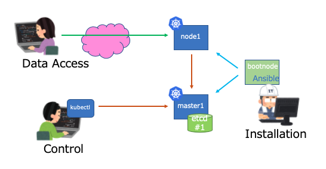

# RatK8s 最小構成

この構成では、ブートノード x1、マスターノード x1、ワーカーノード x1 の構成で、ロードバランサーや冗長構成はない。

この用途としては、小規模かつシンプルなためアプリケーションの開発環境に適している。また、K8sのバージョンアップの検証環境としても利用しやすい。

起動方法はオプションに`-f cluster-config/minimal.yaml`を指定して ansible playbookを完成させる。以下の例では`-s auto`を指定してK8sクラスタを起動している。

~~~
tkr@hibiki:~/rat2$ ./setup.rb -f cluster-config/minimal.yaml -s auto
Bringing machine 'bootnode' up with 'virtualbox' provider...
Bringing machine 'master1' up with 'virtualbox' provider...
Bringing machine 'node1' up with 'virtualbox' provider...
==> bootnode: Importing base box 'ubuntu/bionic64'...
==> bootnode: Matching MAC address for NAT networking...
==> bootnode: Checking if box 'ubuntu/bionic64' version '20200325.0.0' is up to date...
==> bootnode: Setting the name of the VM: rat2_bootnode_1588919770994_65014
~~~

上記の起動では、Linuxのリモートsshが動作可能なansibleの実行環境までが完成した。次に以下の実行例のようにbootnode から ansibleのプレイビックを適用する事で、Kubernetesクラスタの構成が完了する。

~~~
$ vagrant ssh bootnode
$ cd /vagrant
$ ansible-playbook -i hosts_k8s playbook/install_k8s.yml

...

PLAY RECAP ********************************************************************************************************
bootnode                   : ok=115  changed=81   unreachable=0    failed=0    skipped=1    rescued=0    ignored=0   
master1                    : ok=90   changed=55   unreachable=0    failed=0    skipped=20   rescued=0    ignored=7   
node1                      : ok=66   changed=37   unreachable=0    failed=0    skipped=15   rescued=0    ignored=4   
~~~

完了した状態では、ワーカーノードの１つだけリストされる。実際には、この他にマスターノードも起動しているが、この構成ではマスターノードにkubeletを導入していないため、ノードのリストには表示されない。クラウドプロバイダーのサービスでは、ほとんどがこのような構成をとっている。

~~~
vagrant@bootnode:/vagrant$ kubectl get node
NAME    STATUS   ROLES    AGE    VERSION
node1   Ready    worker   104s   v1.18.2
~~~

コンポーネントのステータスを表示すると、kube-apiserverを除く、コントローラーマネージャー、スケジューラー、etcdデータベースが動作している事が確認できる。

~~~
vagrant@bootnode:/vagrant$ kubectl get componentstatus
NAME                 STATUS    MESSAGE             ERROR
controller-manager   Healthy   ok                  
scheduler            Healthy   ok                  
etcd-0               Healthy   {"health":"true"}   
~~~

次のコマンドで、kube-apiserverの動作が `Kubernetes master is running at https://172.16.2.4:6443`として確認できる。
それから、K8sクラスタ内部のDNSサーバー CoreDNS、メトリックスサーバーの動作が確認できる。

~~~
vagrant@bootnode:/vagrant$ kubectl cluster-info
Kubernetes master is running at https://172.16.2.4:6443
CoreDNS is running at https://172.16.2.4:6443/api/v1/namespaces/kube-system/services/kube-dns:dns/proxy
Metrics-server is running at https://172.16.2.4:6443/api/v1/namespaces/kube-system/services/https:metrics-server:/proxy
~~~

メトリックスサーバーが正常に動作していれば、ノードやポッドのCPU、メモリなどの使用状態を取得できる。

~~~
vagrant@bootnode:/vagrant$ kubectl top node
NAME    CPU(cores)   CPU%   MEMORY(bytes)   MEMORY%   
node1   39m          3%     388Mi           43%   
~~~

## 仮想マシンのスペック

この表の値はcluster-config/minimal.yaml のサンプル定義である。
IPアドレス、CPU、メモリの値は自由に変更する事ができる。

| Hostname   | Private IP  | Public IP    | CPU | RAM | HDD |
|:-----------|:------------|:------------:|:---:|:---:|:---:|
| bootnode   | 172.16.2.3  | NA           |  1  | 1GB | 8GB |
| master1    | 172.16.2.4  | NA           |  2  | 2GB | 8GB |
| node1      | 172.16.2.10 | 192.168.1.40 |  1  | 1GB | 8GB |

## Flannel を有効にした場合

cluster-config/minimal.yamlのpod_networkの値を、以下のようにflannelにすると、
ノード間でオーバーレイネットワークが有効化される。

~~~
#pod_network: bridge
pod_network: flannel
~~~

マスターノードもポッドネットワークに組み込まれ、ノードのリストに表示されるようになる。

~~~
vagrant@bootnode:/vagrant$ kubectl get node
NAME      STATUS   ROLES    AGE    VERSION
master1   Ready    master   4m4s   v1.18.2
node1     Ready    worker   87s    v1.18.2
~~~

ただし、マスターノードには、ポッドがスケジュールされないようにtaintを設定してある。
