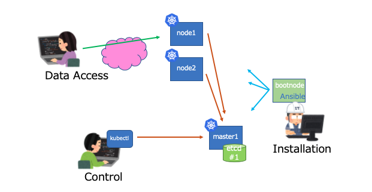

# default.yaml

~~~
$ ./setup.rb -f cluster-config/default.yaml -s auto
~~~

次にbootnodeからansibleを実行する事で、Kubernetesクラスタの設定が完了する。

~~~
$ vagrant ssh bootnode
$ cd /vagrant
$ ansible-playbook -i hosts_k8s playbook/install_k8s.yml

...

PLAY RECAP ****************************************************************************************
bootnode    : ok=117  changed=82   unreachable=0    failed=0    skipped=0    rescued=0    ignored=0   
master1     : ok=136  changed=88   unreachable=0    failed=0    skipped=4    rescued=0    ignored=7   
node1       : ok=75   changed=42   unreachable=0    failed=0    skipped=4    rescued=0    ignored=4   
node2       : ok=75   changed=42   unreachable=0    failed=0    skipped=4    rescued=0    ignored=4   
~~~

~~~
$ kubectl get node
NAME      STATUS   ROLES    AGE   VERSION
master1   Ready    master   73m   v1.18.2
node1     Ready    worker   71m   v1.18.2
node2     Ready    worker   71m   v1.18.2
~~~

~~~
$ kubectl get componentstatus
NAME                 STATUS    MESSAGE             ERROR
scheduler            Healthy   ok                  
etcd-0               Healthy   {"health":"true"}   
controller-manager   Healthy   ok
~~~

~~~
$ kubectl cluster-info
Kubernetes master is running at https://172.16.2.4:6443
CoreDNS is running at https://172.16.2.4:6443/api/v1/namespaces/kube-system/services/kube-dns:dns/proxy
Metrics-server is running at https://172.16.2.4:6443/api/v1/namespaces/kube-system/services/https:metrics-server:/proxy
~~~

~~~
$ kubectl get node 
NAME      STATUS   ROLES    AGE   VERSION
master1   Ready    master   75m   v1.18.2
node1     Ready    worker   73m   v1.18.2
node2     Ready    worker   73m   v1.18.2
~~~

~~~
$ kubectl top node
NAME      CPU(cores)   CPU%   MEMORY(bytes)   MEMORY%   
master1   89m          9%     1014Mi          53%       
node1     86m          3%     547Mi           61%       
node2     86m          4%     445Mi           50%    
~~~